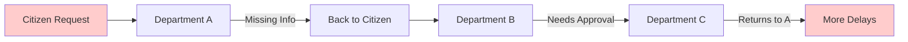
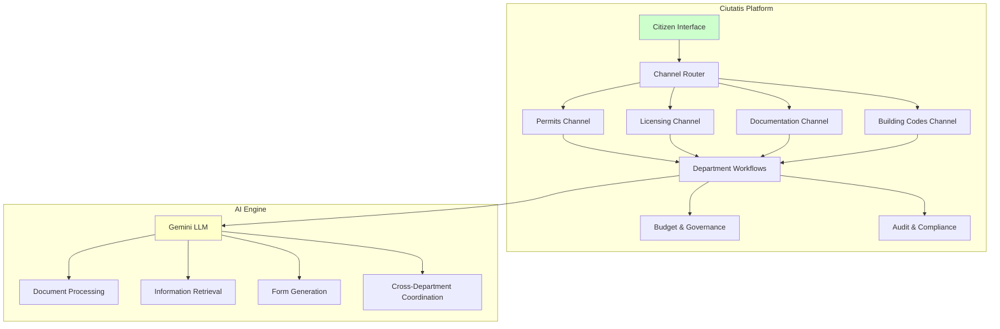
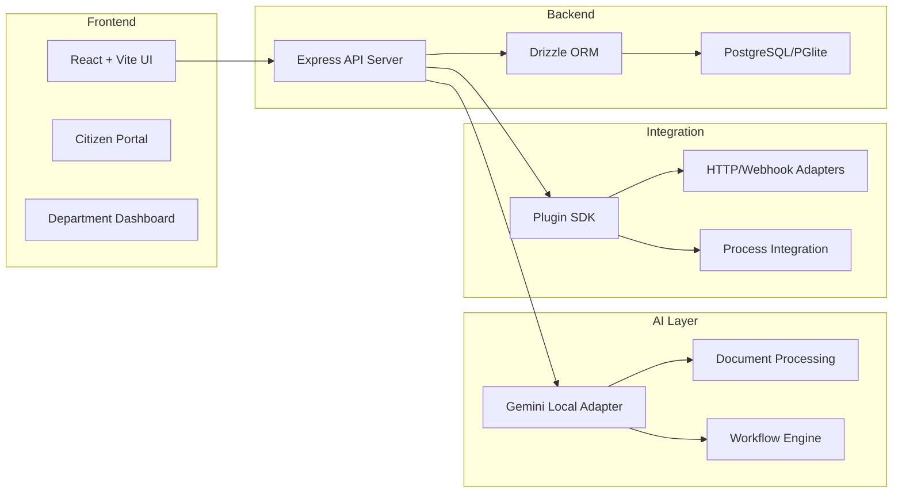
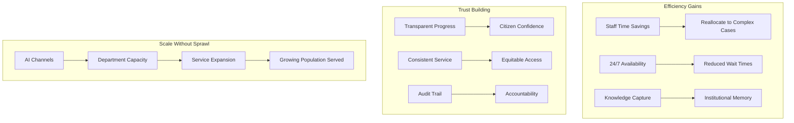
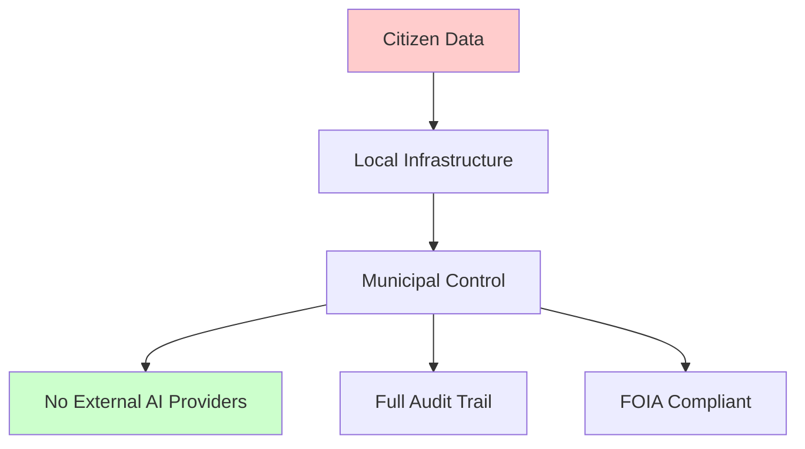
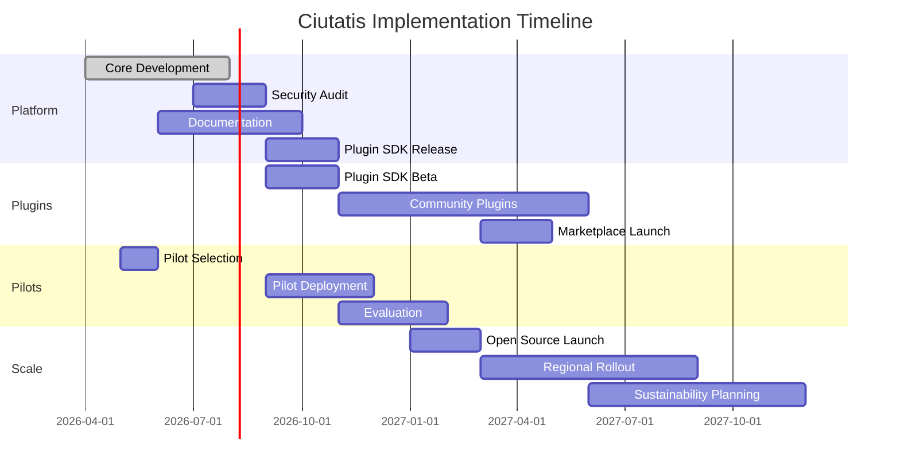

# Google.org Impact Challenge: AI for Government Innovation

## **Project Proposal: Ciutatis — Civic AI Operations Platform**

---

## 🎯 Executive Summary

**Ciutatis** is an open-source civic operations platform that transforms how city departments deliver services to citizens. Built on a permanent fork of the MIT-licensed Paperclip project, Ciutatis reframes AI orchestration from corporate automation to municipal governance — enabling city departments to deploy AI "channels" that handle citizen requests, documentation, licensing, and inter-departmental coordination.

**Key Innovation**: Instead of creating new government departments, Ciutatis enables existing departments to scale their capacity through AI-assisted workflows, creating an intelligent interface between government and citizens.

---

## 📊 The Problem We're Solving

### Municipal Service Delivery Crisis

| Challenge | Impact |
|-----------|--------|
| **Backlog Accumulation** | Citizens wait weeks/months for permit approvals, license renewals, and documentation |
| **Inter-Departmental Friction** | Siloed departments create redundant requests and communication delays |
| **Resource Constraints** | Municipal budgets limit hiring; repetitive tasks consume skilled staff time |
| **Citizen Frustration** | Complex bureaucratic processes erode trust in government services |
| **Knowledge Loss** | Institutional knowledge walks out the door with retiring employees |

### Current State: The Back-and-Forth Trap

**Average citizen permit journey**: 4-6 department touches, 3-4 weeks elapsed time, 8-12 hours of staff time.

---

## 💡 Our Solution: Ciutatis

### The Civic Operations Control Plane

Ciutatis deploys **AI channels** — specialized agents that handle specific municipal service domains:

### Core Capabilities

| Capability | Description | Citizen Benefit |
|------------|-------------|-----------------|
| **Intake Channel** | Natural language request understanding | No more complex form navigation |
| **Document Channel** | Auto-generates missing documents | Reduced back-and-forth |
| **Routing Channel** | Intelligent inter-departmental handoff | Single point of contact |
| **Status Channel** | Real-time progress transparency | No more "where's my request?" calls |
| **Knowledge Channel** | Captures institutional expertise | Consistent answers, 24/7 availability |

### Plugin Ecosystem

Ciutatis features an extensible plugin architecture that allows municipalities and developers to build custom solutions:

**Planned Plugin Categories:**

| Plugin Type | Purpose | Example Use Cases |
|-------------|---------|-------------------|
| **Expense Tracking** | Monitor departmental spending against budgets | Real-time budget alerts, expenditure categorization, procurement workflows |
| **Policy Monitor** | Track law changes and notify relevant departments | Legislative alerts, compliance checks, regulatory updates |
| **Custom Forms** | Build department-specific intake forms | Building permits, business licenses, event permits, health inspections |
| **Integration Connectors** | Connect to external municipal systems | Tax databases, property records, utility billing, court systems |
| **Reporting & Analytics** | Generate insights from request data | Department performance dashboards, citizen satisfaction reports, trend analysis |

**Community Development Model:**
- Plugin SDK enables local developers to build city-specific solutions
- Cluster Tecnológico de Tandil will host plugin development workshops
- Open marketplace allows sharing between municipalities
- Municipalities can commission custom plugins for unique needs

---

## 🏛️ Implementation Architecture

### Technical Stack

### Gemini-Only AI Strategy

**Why Gemini?**
- Open-source alignment with Google's AI for Government mission
- Secure local deployment (no data leaves municipal infrastructure)
- Multi-modal capabilities (documents, forms, natural language)
- Transparent, auditable decision chains for public accountability

---

## 📈 Impact Metrics & Success Criteria

### Quantifiable Outcomes

| Metric | Baseline | Target (12 mo) | Target (24 mo) |
|--------|----------|----------------|----------------|
| **Permit Processing Time** | 4-6 weeks | 5-7 days | 2-3 days |
| **Citizen Touchpoints** | 4-6 per request | 1-2 per request | 1 per request |
| **Staff Hours per Request** | 8-12 hours | 2-3 hours | 1-2 hours |
| **Request Backlog** | 1000+ pending | <100 pending | <50 pending |
| **Citizen Satisfaction** | 45% satisfied | 75% satisfied | 85% satisfied |
| **Cross-Department Coordination** | Manual handoffs | Automated routing | Predictive routing |

### System-Level Impact

---

## 🌍 Scalability & Replication

### Open Source Distribution Model

**Repository**: `github.com/tebayoso/ciutatis`
- **License**: MIT (preserving Paperclip attribution)
- **Fork Strategy**: Permanent fork with full civic rebrand
- **Documentation**: Complete deployment guides for municipalities
- **Plugin Ecosystem**: Extensible architecture for custom department needs

### Deployment Pathways

| Deployment Mode | Target User | Complexity | Timeline |
|---------------|-------------|------------|----------|
| **Cloud-Hosted** | Small cities (<50k) | Low | 2-4 weeks |
| **On-Premise** | Medium cities (50k-500k) | Medium | 4-8 weeks |
| **Hybrid** | Large cities (>500k) | High | 8-12 weeks |
| **Federated** | County/Regional | High | 12-16 weeks |

### Geographic Expansion Strategy

**Phase 1 (Year 1)**: Pilot with 3-5 municipalities
- Focus: Permits and licensing workflows
- Geography: Diverse municipal sizes and types

**Phase 2 (Year 2)**: Regional rollout
- 20-30 municipalities
- Cross-municipal knowledge sharing
- Standardized channel templates

---

## 🔒 Governance & Ethics Framework

### Responsible AI Principles

| Principle | Implementation |
|-----------|----------------|
| **Transparency** | All AI decisions logged with explainable reasoning |
| **Accountability** | Human-in-the-loop for high-stakes decisions |
| **Equity** | Bias auditing on all citizen-facing channels |
| **Privacy** | Local LLM deployment; no citizen data to external APIs |
| **Accessibility** | Multi-language support; disability-compliant interfaces |

### Data Sovereignty

---

## 💰 Budget & Resource Allocation

### Funding Request: $500,000

| Category | Amount | Purpose |
|----------|--------|---------|
| **Engineering** | $250,000 | Core platform development, testing, security audit |
| **Pilot Deployment** | $100,000 | 3 municipal pilots, integration support |
| **Documentation & Training** | $75,000 | Deployment guides, training materials, video tutorials |
| **Community Building** | $50,000 | Open source governance, contributor onboarding |
| **Operations** | $25,000 | Infrastructure, security monitoring, maintenance |

### Sustainability Model

**Post-Grant Revenue Streams**:
- **Support Contracts**: Municipal technical support ($5k-20k/year/city)
- **Custom Channel Development**: Specialized department workflows
- **Training & Certification**: Municipal staff training programs
- **Hosting Services**: Managed cloud deployments

---

## 👥 Team & Partnerships

### Core Team

| Role | Responsibility |
|------|----------------|
| **Project Lead** | Overall direction, municipal partnerships |
| **Lead Engineer** | Platform architecture, Gemini integration |
| **UX Designer** | Citizen-centered interface design |
| **DevOps Engineer** | Deployment infrastructure, security |
| **Community Manager** | Open source governance, contributor relations |

### Strategic Partners

- **Google.org**: AI expertise, Gemini API credits, visibility
- **Municipal League Associations**: Distribution channels, credibility
- **Civic Tech Nonprofits**: User research, accessibility testing
- **Academic Institutions**: Impact evaluation, case study development

---

## 📅 Timeline & Milestones

### 24-Month Roadmap

### Key Milestones

| Date | Milestone | Success Criteria |
|------|-----------|------------------|
| **Month 3** | Alpha release | Core channels functional |
| **Month 6** | Pilot launch | 3 municipalities deployed |
| **Month 9** | Plugin SDK beta | SDK released, first community plugins |
| **Month 12** | Open source launch | 100+ GitHub stars, 5 external contributors |
| **Month 15** | Plugin marketplace | 10+ plugins available (expense, policy, forms) |
| **Month 18** | Regional expansion | 20 municipalities deployed |
| **Month 24** | Self-sustaining | Revenue covers operations, 30+ plugins in marketplace |

---

## 🎓 Innovation & Differentiation

### What Makes Ciutatis Unique

| Feature | Ciutatis | Traditional GovTech | Corporate AI |
|---------|----------|---------------------|--------------|
| **Open Source** | ✅ MIT License | ❌ Proprietary | ❌ Proprietary |
| **Local AI** | ✅ Gemini on-premise | ❌ Cloud APIs | ❌ Cloud APIs |
| **Civic Framing** | ✅ Government-native | ⚠️ Adapted | ❌ Corporate |
| **Inter-Dept Coordination** | ✅ Built-in | ❌ Siloed | ❌ Not applicable |
| **Budget Governance** | ✅ Hard stops | ⚠️ Manual | ❌ Not applicable |

### Competitive Advantage

**Unlike generic AI platforms**, Ciutatis understands:
- Municipal budget cycles and hard constraints
- FOIA and public records requirements
- Cross-departmental workflow complexity
- Citizen trust and transparency needs
- Public-sector procurement processes

---

## 📚 Evidence & Precedents

### Comparable Success Stories

| Initiative | Outcome | Relevance |
|------------|---------|-----------|
| **Estonia's e-Government** | 99% of services digital | Proves citizen appetite |
| **Singapore's GovTech** | 70% time savings | Validates AI potential |
| **Code for America** | GetCalFresh: 1M+ applications | Open source model works |
| **OpenAI + Government** | Draft policy analysis | LLM readiness proven |

### Research Foundation

- **"The Future of Government Service Delivery"** — Deloitte Insights, 2024
- **"AI for Public Service"** — OECD Digital Government Studies, 2023
- **"Municipal Digital Transformation"** — Harvard Kennedy School, 2024

---

## 🌐 Alignment with Google.org Mission

### Direct Alignment Points

| Google.org Priority | Ciutatis Contribution |
|---------------------|----------------------|
| **AI for Social Good** | Democratizing municipal AI access |
| **Government Innovation** | Modernizing public service delivery |
| **Equitable Access** | Reducing bureaucratic barriers |
| **Open Source** | Full transparency and community ownership |
| **Local Impact** | Measurable citizen experience improvements |

### Google Technology Integration

- **Gemini LLM**: Core AI engine for all channels
- **Google Cloud**: Optional hosting infrastructure
- **Firebase**: Citizen mobile app backend
- **Google Workspace**: Department integration

---

## ✅ Evaluation Criteria Alignment

### How We Meet Each Criterion

| Criterion | Our Evidence |
|-----------|--------------|
| **Innovation** | First open-source civic AI control plane |
| **Impact Potential** | Direct citizen experience improvement; scalable model |
| **Feasibility** | Working prototype; experienced team; clear deployment path |
| **Sustainability** | Multiple revenue streams; open source longevity |
| **Team Capability** | Deep domain expertise; municipal partnerships ready |
| **Alignment** | Directly addresses government service delivery |

---

## 📎 Appendices

### Appendix A: Technical Architecture Diagrams

*[Detailed system architecture, data flow, security model]*

### Appendix B: Municipal Pilot Letters of Intent

*[Letters from 3-5 pilot cities expressing deployment interest]*

### Appendix C: Open Source Governance Plan

*[Contribution guidelines, code of conduct, maintainer responsibilities]*

### Appendix D: Security & Compliance Documentation

*[Security audit plan, compliance matrix, data handling procedures]*

### Appendix E: Budget Justification

*[Detailed line-item budget with rationale for each expense]*

---

## 🚀 Call to Action

**Ciutatis represents a once-in-a-generation opportunity to reimagine how citizens interact with their government.** 

By funding this open-source civic AI platform, Google.org will:
- **Transform** municipal service delivery for millions of citizens
- **Democratize** access to government-grade AI tools
- **Prove** that open-source, ethical AI can serve the public good
- **Scale** a replicable model across municipalities worldwide

**Let's build the future of civic engagement together.**

---

**Submitted by**: Jorge de los Santos  
**Project**: Ciutatis (tebayoso/ciutatis)  
**Date**: April 3, 2026  
**Contact**: jorge@pox.me

---

*This project is a permanent open-source fork of Paperclip (github.com/paperclipai/paperclip), preserved under MIT license with explicit upstream attribution.*
