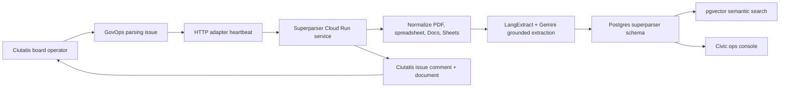

# Superparser Architecture

Date: 2026-06-08

Superparser is a hybrid agent:

- Ciutatis owns governance, assignment, heartbeat invocation, comments, and issue documents.
- The service owns document ingestion, extraction, classification, embeddings, and search.
- The standalone portal owns the judge-facing demo flow.



## Data Model

- `superparser.ingestion_jobs`: job state and source reference.
- `superparser.documents`: flat document text plus raw source metadata in JSONB.
- `superparser.document_chunks`: chunk text, source spans, token estimate, and vector embedding.
- `superparser.extractions`: grounded extraction facts with source spans and JSONB attributes.
- `superparser.classifications`: document label, confidence, and rationale.
- `superparser.source_activity`: Drive/Workspace activity snapshots when available.
- `superparser.search_queries`: audit trail of demo and user queries.

## Deployment

Service:

```sh
cd apps/superparser-service
gcloud builds submit --tag us-central1-docker.pkg.dev/$GOOGLE_CLOUD_PROJECT/superparser/superparser-service:latest
gcloud run deploy superparser-service \
  --image us-central1-docker.pkg.dev/$GOOGLE_CLOUD_PROJECT/superparser/superparser-service:latest \
  --region us-central1 \
  --set-secrets GOOGLE_API_KEY=GOOGLE_API_KEY:latest,SUPERPARSER_DATABASE_URL=SUPERPARSER_DATABASE_URL:latest
```

Portal:

```sh
pnpm --filter @ciutatis/superparser-portal build
```

The portal can be hosted as static assets or served from a preview host for the hackathon submission.
